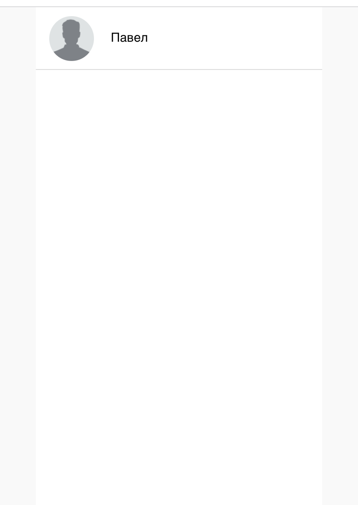
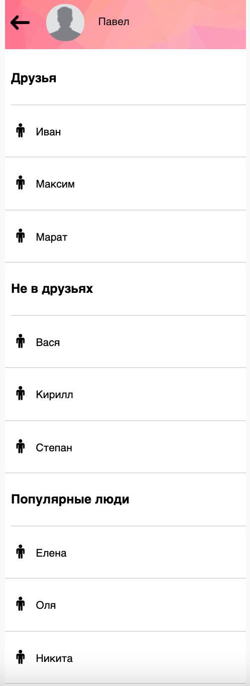

# Задача 1. Список друзей

## Описание

Написать скрипт, который отобразит на странице список имен на основе данных, полученных из файла `data.json`.
По аналогии с скриншотом:

При клике на правильно созданный элемент списка должна открываться карточка выбранного элемента, в которой будут отображаться список его друзей, список людей которых нет в его друзьях. 

А так же список людей, которых больше всего в в друзьях среди всего списка контактов из файла `data.json`. В случае, если список популярных контактов будет конкурирующее количество, то отсортировать по алфавиту поля `name`.

В каждой категории должно выводиться не более 3 значений.

Образец того, как это долго выглядить:

## Реализация

Исходный HTML-код изменять разрешено. 
Изменять стили изменять так же разрешено.

Из фреймворков разрешено использовать только VUEJS, при условии полного соблюдения всех его принципов (роутинг, стор и т.д.), но рекомендуется реализовывать на чистом JS.

## Решение с звездочкой

Решение должно быть реализованно с минимальным количеством операций.

# Задача 2. Настройка CI/CD

## Описание

Дополнительные задания, для более глубокого понимания этапов деплоя и закрепления информации:

1) Доделать на GitHub Action deploy.yml, по инструкции с Тильды к лекции, чтобы сайт был опубликован на gh-pages после прохождения соответствующего workflow 

2) Завести аккаунт на GitLab, создать там бесплатный репозиторий и опубликовать через pipeline пакет ui-kit, который был реализован в воркшорпе по Ui-kit (3.1)

Все пошаговые инструкции для выполнения и скриншоты будут на Тильде к воркшопу №7 часть 1, в ПН после 17 часов.